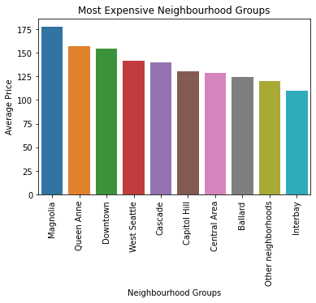

# AirBnB Analysis

## Introduction

This is an analysis on the AirBnB Seattle dataset to find answers to the following questions.
* Is there any variation in booking price according to season?
* Which is the best time to visit Seattle?
* Which is the most preferred neighbourhood in Seattle?
* Which are the most and least expensive areas?

## Files

* The data is contained in three files:
    * Listings, including full descriptions and average review score
    * Reviews, including unique id for each reviewer and detailed comments
    * Calendar, including listing id and the price and availability for that day

  
* airbnb_notebook.ipynb - Jupyter Notebook which contains all the script for this project

## Python Libraries 

pandas (1.3.3)
matplotlib (3.5.0)
seaborn (0.11.2)

## Results

#### Variation in price:

#### Homestays available per month:

#### Preferred neighbourhood:

#### Most and least expensive neighbourhood groups:

A detailed write-up is given [here](https://medium.com/@induvkrishna/analysis-on-airbnb-homestays-in-seattle-13965bafceb8).

## Acknowledgement
This dataset is part of Airbnb Inside, and the original source can be found [here](http://insideairbnb.com/get-the-data.html).